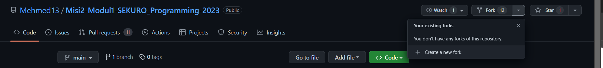
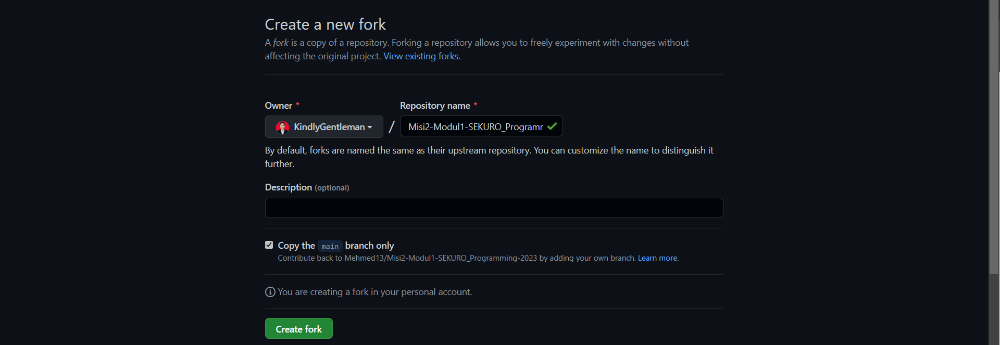
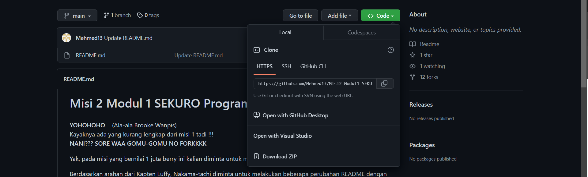

# Github : Fork
Sumber materi dapat diakses melalui [link](https://www.youtube.com/watch?v=8rry2ncZmfg&list=PLFIM0718LjIVknj6sgsSceMqlq242-jNf&index=4) berikut ini

&nbsp;

## Daftar Isi

1. [Apa itu Fork?](#apa-itu-fork-)
2. [Clone](#clone-)
3. [Catatan Tambahan](#catatan-tambahan-)

&nbsp;

## Apa itu Fork? 

**Hah?!? Garpu?! Untuk apa garpu ada di Github? Apakah untuk makan programnya?** Tentu saja tidak. Istilah `Fork` yang digunakan sama-sama menggambarkan percabangan juga di Github. `Fork` merupakan proses duplikasi dari `repo` akun orang lain yang kita buat menjadi `repo` pribadi kita sendiri. Jadi, `fork` akan membuat "siluman" atau "copy" dari `repo` orang lain beserta dengan informasi riwayat dan sejarahnya.

`Repository` asli dan "siluman" yang telah di-`fork` bisa dihubungkan melalui bantuan `pull request`, sama seperti penjelasan pada rangkuman sebelumnya, dimana kita akan mengirimkan perubahan yang kita lakukan pada `repository` hasil `fork` ke `repository` asli. Dengan menggunakan `forking`, kita bisa melakukan modifikasi terhadap `repository` asli tanpa memengaruhi `repository` asli tersebut.

Secara umum, cara yang dapat dilakukan untuk melakukan `forking` adalah:
- Klik tombol "fork"

    

- setelah `forking` dilakukan, kita dapat melakukan *edit* `repository` hasil fork secara bebas

    

- Setelah selesai meng-*edit*, apabila kita merasa perubahan yang kita lakukan berkontribusi pada kemajuan bangsa dan negara, kita dapat melakukan `pull request` pada `repo` asli. Proses ini dilakukan dengan mengklik "Create pull request"
-Pemilik dari `repo` asli akan menerima permintaan tersebut dan bisa melakukan `merge` ke `repo` aslinya

&nbsp;

## Clone 

`clone` adalah proses penggandaan ~~uang Dimas Kanjeng~~ `repository`. Secara umum, `clone` merupakan proses yang akan mengunduh `repository` dari *website* Github ke Git yang ada di komputer lokal. Cara untuk melakukan `clone` adalah dengan mengklik "clone" dan mengunduh `repository` sebagai file berekstensi .zip.

&nbsp;

## Catatan Tambahan 

Key Points:

- `fork` adalah proses duplikasi `repo` akun lain menjadi `repo` pribadi yang nantinya bisa dihubungkan dengan bantuan `pull request` dan `merge `apabila disetujui oleh pemilik.
- `Forking` dilakukan agar kita bisa melakukan modifikasi tanpa memengaruhi `repo` asli.
- `Clone` adalah proses pengunduhan `repo` dari Github ke Git pada komputer dengan mengunduh `repo`sebagai file .zip.